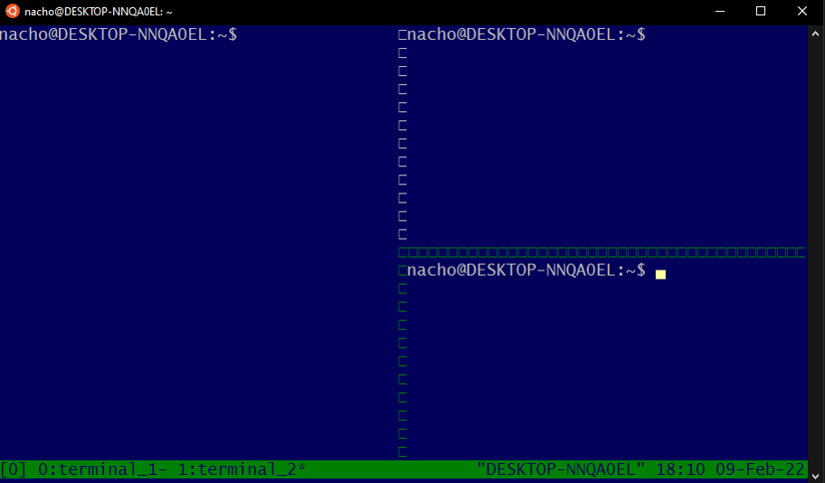

## TMUX
### What is it?
A tool that allows you to split a terminal window into several windows. That is, in a single window you can have several instances of the terminal open, similar to the GNU screen.

### Instalation
```
sudo apt install tmux
```

### Comamnds
In order to activate command mode:
```
ctrl + b 
```

In order to enter tmux from a bash terminal: 
```
tmux
```

This opens a session with default name

Session is a group of tmux terminals

In order to create a sesion with specific name:
```
tmux new -s session_name
```

Attach and detach session:
```
tmux detach / tmux attach-session -t session_name
``` 

Create a terminal:
```
c
```

Rename terminal
```
,
```

Create subterminal horizontally
```
%
```

Create subterminal vertically
```
"
```
Have in mind that this subterminales doesn't allow any scrolling... :(

Change between subterminal
```
->, <-, arrow up, arrow down
```

Kill session
```
tmux kill -s session_name
```


